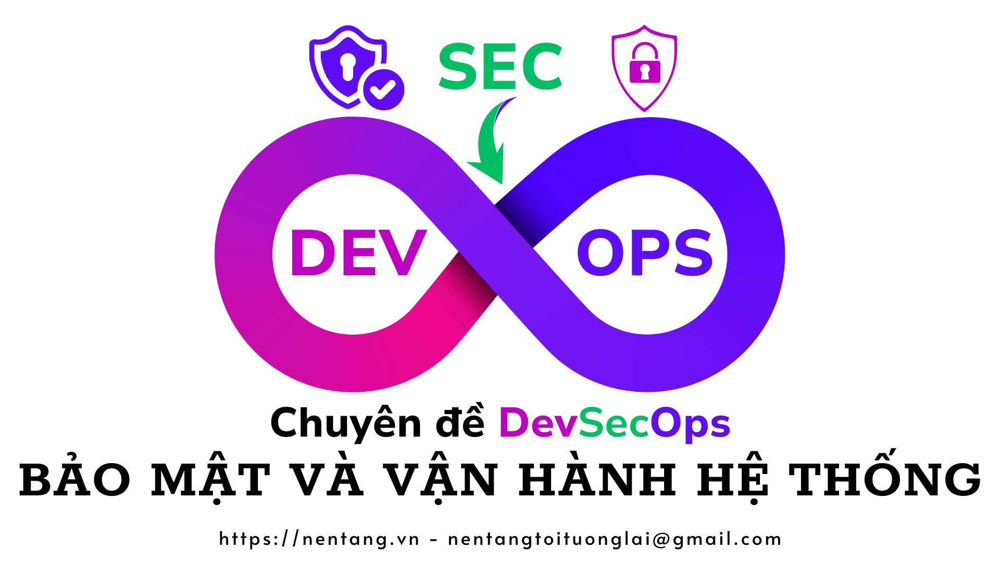
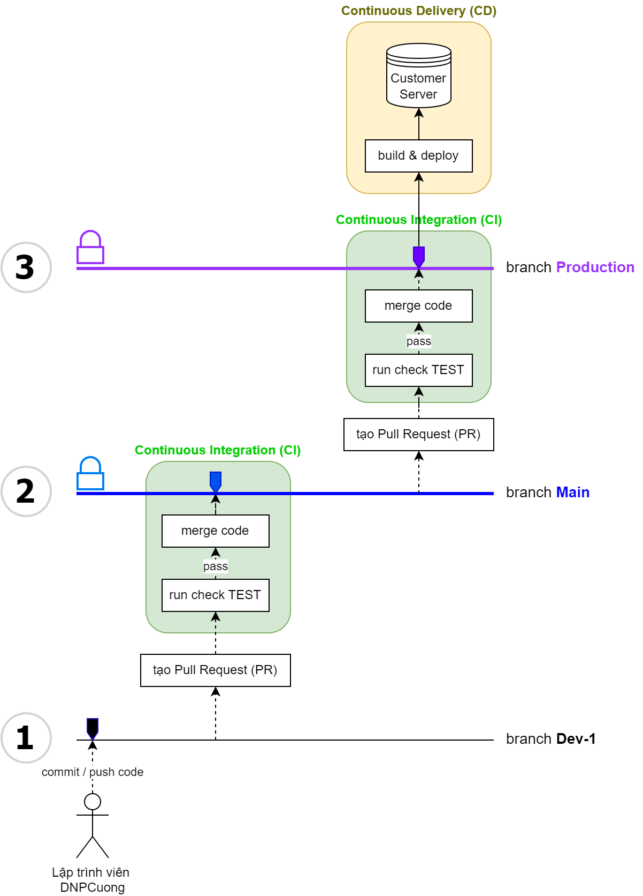

# https://nentang.vn
- Các bài học miễn phí về Lập trình
- Học web Frontend cơ bản HTML-CSS-JS
- Trang web demo http://learning.nentang.vn
- Xem nhiều hơn tại https://nentang.vn

# Học là phải THỰC HÀNH ❤🧡💛💚💙💜🤎

# Workshop DevSecOps - Nghề bảo mật và vận hành Hệ thống

- Chuyên đề về DevSecOps
- Thời gian: 13h30 ngày 12/07/2024 (Thứ Sáu)
- Địa chỉ: Khu III - Đại học Cần Thơ; Số 01 Lý Tự Trọng, Quận Ninh Kiều, TP Cần Thơ
- Diễn giả: Dương Nguyễn Phú Cường
  - Email: phucuong@ctu.edu.vn, nentangtoituonglai@gmail.com

# Các chương trình cần thiết để lập trình web
- Visual Studio Code IDE - trình gõ code - [Visual Studio Code](https://code.visualstudio.com/)
- [Git for window](https://git-scm.com/download/win)
- TortoiseGIT - [TortoiseGIT](https://tortoisegit.org/download/)

# Demo
## Sơ đồ hoạt động (workflow) của GIT

## Các tools sử dụng
1. Husky:
- Cấu hình các hook gits
2. Commitlint:
- Chuẩn hóa câu chữ "commit message"
3. Retire.JS:
- Kiểm tra các thư viện Javascript có bị các lỗ hổng bảo mật nào không?
- Top 10 các lỗi nguy hiểm về web: "Using Components with Known Vulnerabilities"
- `retire --outputformat cyclonedx`
4. SonarQube:
- Công cụ dùng để scan quét đảm bảo code convention, rà soát bug, code...
5. ESLint:
- Kiểm tra việc viết code phải theo chuẩn quy định.